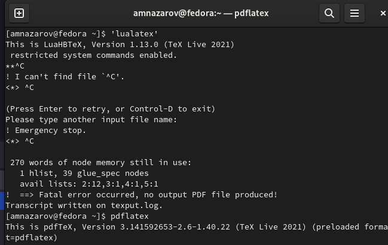
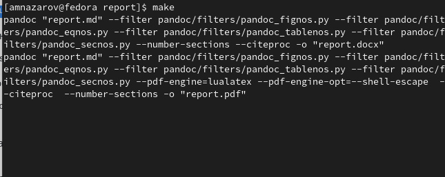
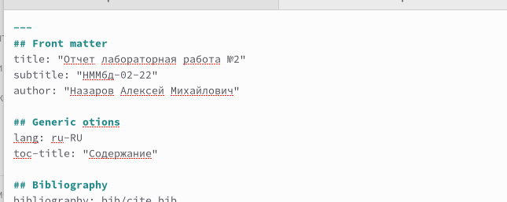
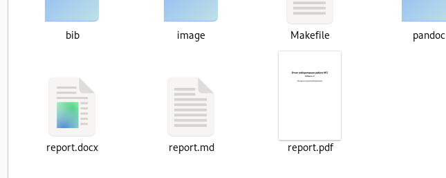

---
## Front matter
lang: ru-RU
title: Презентация по лабораторной работе №3
subtitle: Markdown
author:
  - Назаров А. М.
institute:
  - Российский университет дружбы народов, Москва, Россия
date: 25 февраля 2022

## i18n babel
babel-lang: russian
babel-otherlangs: english

## Formatting pdf
toc: false
toc-title: Содержание
slide_level: 2
aspectratio: 169
section-titles: true
theme: metropolis
header-includes:
 - \metroset{progressbar=frametitle,sectionpage=progressbar,numbering=fraction}
 - '\makeatletter'
 - '\beamer@ignorenonframefalse'
 - '\makeatother'
---

# Информация

## Докладчик

:::::::::::::: {.columns align=center}
::: {.column width="70%"}

  * Назаров АЛексей Михайлович
  * студент
  * студент НММбд-02-22
  * Российский университет дружбы народов

:::
::: {.column width="30%"}

:::
::::::::::::::

## Цели и задачи

Научиться оформлять лабораторные работы в Markdown

# Ход работы

## Установка  pandoc в Texlive

Для начала устанавливаем pandoc, pandoc-citeproc, pandoc-crossref для работы с текстовым редактором.Устанавливаем TexLive.

## Проверка на работоспосность

##  Оформление отчета

## Завершение работы

Ввводим команду make в терминале и убеждаемся в том, что файлы появились в трех форматах

# Результат

## Вывод

Я научился оформлять отчеты в Markdown

