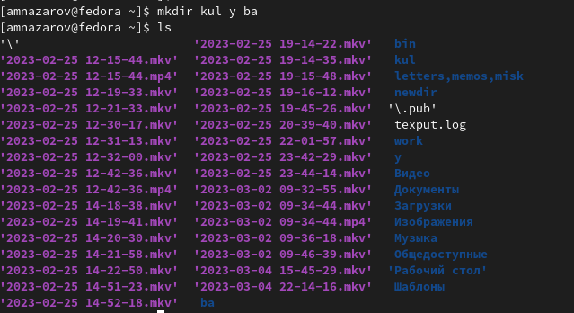

---
## Front matter
lang: ru-RU
title: Презентация по лабораторной работе №4
subtitle: Основы взаимодействия с системой Unix
author:
  - Назаров А. М.
institute:
  - Российский университет дружбы народов, Москва, Россия
date: 25 февраля 2022

## i18n babel
babel-lang: russian
babel-otherlangs: english

## Formatting pdf
toc: false
toc-title: Содержание
slide_level: 2
aspectratio: 169
section-titles: true
theme: metropolis
header-includes:
 - \metroset{progressbar=frametitle,sectionpage=progressbar,numbering=fraction}
 - '\makeatletter'
 - '\beamer@ignorenonframefalse'
 - '\makeatother'
---

# Информация

## Докладчик

:::::::::::::: {.columns align=center}
::: {.column width="70%"}

  * Назаров АЛексей Михайлович
  * студент
  * студент НММбд-02-22
  * Российский университет дружбы народов

:::
::: {.column width="30%"}

:::
::::::::::::::

# Вводная часть

## Цели и задачи

- Приобретение практических навыков взаимодействия пользователя с системой посредством командной строки.

# Ход работы

## Команда pwd.

Команда pwd служит для обозначения полного имени каталога. Если вы перемещаетесь между каталогами, чтобы убедиться там ли вы находитесь, где надо, используем команду pwd, которая покажет весь путь до каталога, где вы сейчас.

## Команда cd.

Команда cd служит для перехода между каталогами. Мы можем последовательно вбивать названия каталогов чтобы перейти в нужную нам директорию.

## Команда mkdir.

Эта команда создает новые каталоги и подкаталоги. За раз мы можем создать несколько каталогов, или создать подкаталог, не переходя в каталог откуда он создается. 

## Команда ls.

Команда ls служит для просмотра содержимого каталогов. Мы можем просмотривать любой каталог, если зададим к нему путь. Так же эта команда имеет огромное количество дополнительных функций, таких как : просмотри расширенных параметров, сортировка по времени, просмотр скрытых файлов и тд.

## Команда man.

Команда man служит для изучения остальных команд. Для ее использования вводим команду man <Команда о которой хотим узнать>. К примеру, чтобы узнать все функции команды cd, нам нужно написать man cd.

## Команда history.

Эта команда отображает историю введенных команд. Так же есть функция модификации, когда мы можем изменять какую-либо команду, если неправильно ее активировали.

# Результаты

## Вывод 

Я приобрел практические навыки взаимодействия пользователя с системой посредством командной строки.
