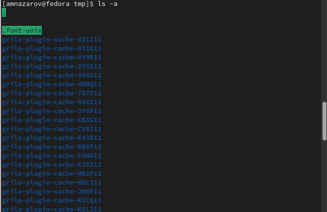

---
## Front matter
title: "Отчет по лабораторной работе №4"
subtitle: "Основы взаимодействия с системой Unix"
author: "Назаров Алексей Михайлович"

## Generic otions
lang: ru-RU
toc-title: "Содержание"

## Bibliography
bibliography: bib/cite.bib
csl: pandoc/csl/gost-r-7-0-5-2008-numeric.csl

## Pdf output format
toc: true # Table of contents
toc-depth: 2
lof: true # List of figures
lot: true # List of tables
fontsize: 12pt
linestretch: 1.5
papersize: a4
documentclass: scrreprt
## I18n polyglossia
polyglossia-lang:
  name: russian
  options:
	- spelling=modern
	- babelshorthands=true
polyglossia-otherlangs:
  name: english
## I18n babel
babel-lang: russian
babel-otherlangs: english
## Fonts
mainfont: PT Serif
romanfont: PT Serif
sansfont: PT Sans
monofont: PT Mono
mainfontoptions: Ligatures=TeX
romanfontoptions: Ligatures=TeX
sansfontoptions: Ligatures=TeX,Scale=MatchLowercase
monofontoptions: Scale=MatchLowercase,Scale=0.9
## Biblatex
biblatex: true
biblio-style: "gost-numeric"
biblatexoptions:
  - parentracker=true
  - backend=biber
  - hyperref=auto
  - language=auto
  - autolang=other*
  - citestyle=gost-numeric
## Pandoc-crossref LaTeX customization
figureTitle: "Рис."
tableTitle: "Таблица"
listingTitle: "Листинг"
lofTitle: "Список иллюстраций"
lotTitle: "Список таблиц"
lolTitle: "Листинги"
## Misc options
indent: true
header-includes:
  - \usepackage{indentfirst}
  - \usepackage{float} # keep figures where there are in the text
  - \floatplacement{figure}{H} # keep figures where there are in the text
---

# Цель работы

Приобретение практических навыков взаимодействия пользователя с системой посредством командной строки.

# Выполнение лабораторной работы

1)Определение полного имени домашнего каталога, при помощи команды pwd

{#fig:001 width=70%}

2)Я перешел в каталог /tmp

{#fig:002 width=70%}

2-1)Вывожу содержимое каталога /tmp

{#fig:003 width=70%}

{#fig:004 width=70%}

{#fig:005 width=70%}

2-2)Проверяю каталог /var/spool на наличие подкаталога cron

{#fig:006 width=70%}

2-2)Перешел в домашний каталог и проверил его содержимое

{#fig:007 width=70%}

3) Создание нового каталог с именем newdir в домашнем каталоге

{#fig:008 width=70%}

3-1) Создание нового каталог с именем morefun в ~/newdir

{#fig:009 width=70%}

3-2) Создание трex новых каталогов с именами letters, memos, misk в домашнем каталоге и затем их удаление

{#fig:009 width=70%}

3-3) Я попытался удалить каталог newdir исользуя команду rm, но он не удаляется без дополнения
{#fig:010 width=70%}

5) С помощью команды man я определил, что функция -l показывает развернутое описание файлов, а команда -t сортирует файлы и каталоги по времени, начиная с самого нового.

{#fig:011 width=70%}

6) Я использовал команду man для просмотра описания следующих команд: pwd, mkdir,rmdir, rm

- man pwd. Команда pwd показывает имя каталога или директории где мы находимся. 

{#fig:012 width=70%}

- man mkdir. Команда mkdir используется для создания каталогов и подкаталогов. Мы можем создать несколько каталогов за раз, или создать новую директорию находясь в другом каталоге.

{#fig:013 width=70%}

- man rmdir. Команда, которая используется для удаления директорий или каталогов.

{#fig:014 width=70%}

- man rm. Команда rm служит для удаления файлов. Имеет много функций с помощью которых можно удалять и каталоги и любые файлы.

{#fig:015 width=70%}

7) Я ввел команду history.

{#fig:016 width=70%}

# Контрольные вопросы

1) Что такое командная строка?

- В ОС Linux командная строка является основным элементов во взаимодействии пользователя и системы.
 
2) При помощи какой команды можно определить абсолютный путь текущего каталога?
Приведите пример.

- Для определения абсолютного пути к текущему каталогу используется команда pwd (print working directory). Например, при вводе данной команды в домашнем каталоге, он выведет /home/amnazarov.
 
3)  При помощи какой команды и каких опций можно определить только тип файлов
и их имена в текущем каталоге? Приведите примеры.

- С помощью команды ls и опция F можно получить информацию о типах файлов (каталог, исполняемый файл, ссылка). Например, если ввести команду ls -F в домашнем каталоге, то выведется название каталогов, каоторые находятся в нем, и “/” после имени(Загрузки/).

4) Каким образом отобразить информацию о скрытых файлах? Приведите примеры.

- С помощью команды ls и опция F можно получить информацию о типах файлов (каталог, исполняемый файл, ссылка). Например, если ввести команду ls -F в домашнем каталоге, то выведется название каталогов, каоторые находятся в нем, и “/” после имени(Загрузки/).
 
5) При помощи каких команд можно удалить файл и каталог? Можно ли это сделать
одной и той же командой? Приведите примеры.

- Каталог можно удалить с помощью команды rmdir, а файлы с помощью rm. Если в каталоге есть какие-то файлы, то мjжно все сразу командой rm с опцией r.

6) Каким образом можно вывести информацию о последних выполненных пользователем командах? работы?

- Команда history выводит все ранее выполненные команды, которые нумеруются. Воспльзоавашись !n:s/m/k, где вместо n вводим номер команды из истории, вместо m, что меняем, а вместо к, на что меняем.
 
7) Как воспользоваться историей команд для их модифицированного выполнения? Приведите примеры.

- Воспльзоавашись !n:s/m/k, где вместо n вводим номер команды из истории, вместо m, что меняем, а вместо к, на что меняем. 

8) Приведите примеры запуска нескольких команд в одной строке.

- Для использование нескольких команд последовательно в одной строке, необходимо их разделить их символом “;”. Например, > cd; ls
 
9) Дайте определение и приведите примера символов экранирования.

- Экранирование символов — замена в тексте управляющих символов на соответствующие текстовые подстановки. Например, ‘.’

10) Охарактеризуйте вывод информации на экран после выполнения команды ls с опцией l.

- Будет выведена следующая информация: тип файла, право доступа, число ссылок, владелец, размер, дата последней ревизии, имя файла или каталога.

11) Что такое относительный путь к файлу? Приведите примеры использования относительного и абсолютного пути при выполнении какой-либо команды.

- Относительный показывает путь к файлу относительно какой-либо “отправной точки”. Например: > cd ~/work/study. Данной командой можно перейти в катало study из любой отправной точки, т.е. мы используем абслоютный путь к файлу.
cd 2022-2023
Данной командой из каталога study можно перейти к каталогу 2022-2023. Такой путь можно назвать относительным

12) Как получить информацию об интересующей вас команде?

- Воспользоваться командой man и через пробел ввести название команды, информацию которой мы хотим получить.

13)Какая клавиша или комбинация клавиш служит для автоматического дополнения
вводимых команд?

- Клавиша Tab служит для автоматического дополнения вводимых команд.
 
# Выводы

Я приобрел практические навыки взаимодействия пользователя с системой посредством командной строки.

# Список литературы{.unnumbered}

::: {#refs}
:::
