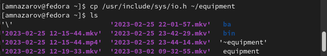

---
## Front matter
lang: ru-RU
title: Презентация по лабораторной работе №5
subtitle: Анализ файловой системы Linux. Команды для работы с файлами и каталогами
author:
  - Назаров А. М.
institute:
  - Российский университет дружбы народов, Москва, Россия
date: 25 февраля 2022

## i18n babel
babel-lang: russian
babel-otherlangs: english

## Formatting pdf
toc: false
toc-title: Содержание
slide_level: 2
aspectratio: 169
section-titles: true
theme: metropolis
header-includes:
 - \metroset{progressbar=frametitle,sectionpage=progressbar,numbering=fraction}
 - '\makeatletter'
 - '\beamer@ignorenonframefalse'
 - '\makeatother'
---

# Информация

## Докладчик

:::::::::::::: {.columns align=center}
::: {.column width="70%"}

  * Назаров АЛексей Михайлович
  * студент
  * студент НММбд-02-22
  * Российский университет дружбы народов

:::
::: {.column width="30%"}

:::
::::::::::::::

# Вводная часть

## Цели и задачи

Ознакомление с файловой системой Linux, её структурой, именами и содержанием каталогов. Приобретение практических навыков по применению команд для работы с файлами и каталогами, по управлению процессами (и работами), по проверке использования диска и обслуживанию файловой системы.

# Ход работы

## Команда cp

С помощью этой команды можно переименовывать файл или каталог при переносе. Если нужно скопировать каталог, добавляется функция -r

## Команда mv

Как и в случае с cp мы можем переименовывать файл или каталог, когда его переносим.

## Команда chmod.

Команда chmod используется для изменения разрешений файлов или каталогов. 

## Команда man

Показывает все модификации той или иной команды

# Результат

## Вывод

Я ознакомился с файловой системой, ее структурой и содержанием. Приобрел практические навыки по применению команд для рабты с файлами и каталогами.

