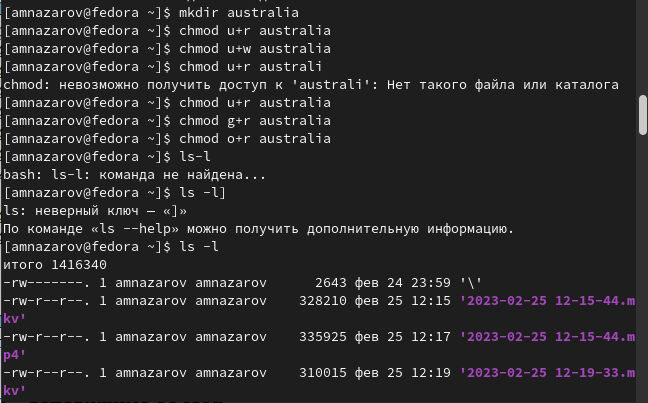
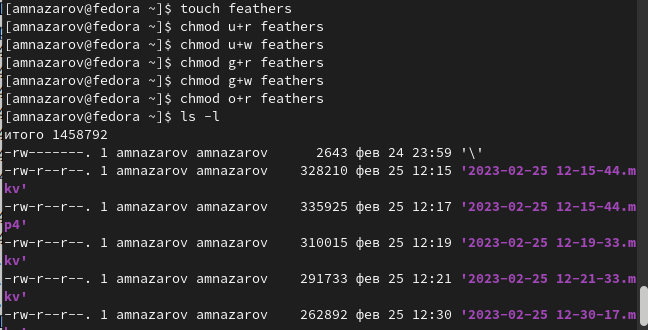
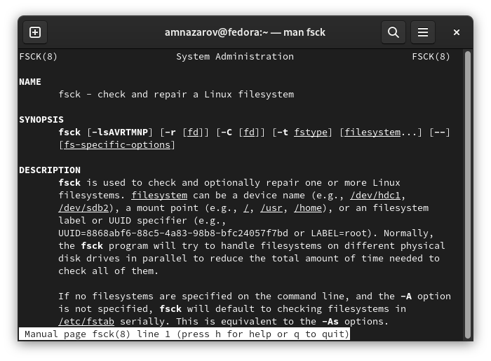
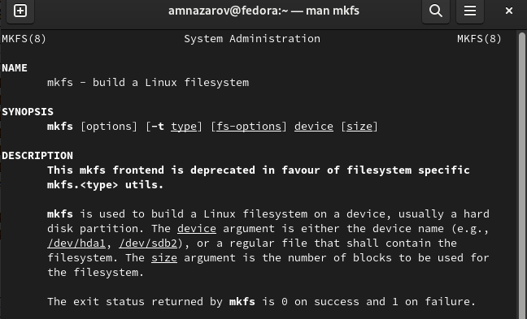
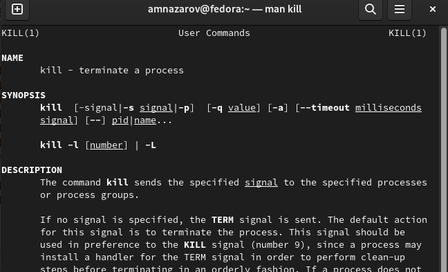

---
## Front matter
title: "Отчет по лабораторной работе №5"
subtitle: "Анализ файловой системы Linux.Команды для работы с файлами и каталогами"
author: "Назаров Алексей Михайлович"

## Generic otions
lang: ru-RU
toc-title: "Содержание"

## Bibliography
bibliography: bib/cite.bib
csl: pandoc/csl/gost-r-7-0-5-2008-numeric.csl

## Pdf output format
toc: true # Table of contents
toc-depth: 2
lof: true # List of figures
lot: true # List of tables
fontsize: 12pt
linestretch: 1.5
papersize: a4
documentclass: scrreprt
## I18n polyglossia
polyglossia-lang:
  name: russian
  options:
	- spelling=modern
	- babelshorthands=true
polyglossia-otherlangs:
  name: english
## I18n babel
babel-lang: russian
babel-otherlangs: english
## Fonts
mainfont: PT Serif
romanfont: PT Serif
sansfont: PT Sans
monofont: PT Mono
mainfontoptions: Ligatures=TeX
romanfontoptions: Ligatures=TeX
sansfontoptions: Ligatures=TeX,Scale=MatchLowercase
monofontoptions: Scale=MatchLowercase,Scale=0.9
## Biblatex
biblatex: true
biblio-style: "gost-numeric"
biblatexoptions:
  - parentracker=true
  - backend=biber
  - hyperref=auto
  - language=auto
  - autolang=other*
  - citestyle=gost-numeric
## Pandoc-crossref LaTeX customization
figureTitle: "Рис."
tableTitle: "Таблица"
listingTitle: "Листинг"
lofTitle: "Список иллюстраций"
lotTitle: "Список таблиц"
lolTitle: "Листинги"
## Misc options
indent: true
header-includes:
  - \usepackage{indentfirst}
  - \usepackage{float} # keep figures where there are in the text
  - \floatplacement{figure}{H} # keep figures where there are in the text
---

# Цель работы

Ознакомление с файловой системой Linux, её структурой, именами и содержанием
каталогов. Приобретение практических навыков по применению команд для работы
с файлами и каталогами, по управлению процессами (и работами), по проверке использования диска и обслуживанию файловой системы.

# Выполнение лабораторной работы

1) Я выполнил все примеры приведенные в первой части лабораторной работы. 

2.1) Файл /usr/include/io.h я скопировал в домашний каталог и переименовал.

{#fig:01 width=70%}

2.2) В домашнем каталоге я создал директорию ski.plases и перенес туда файл.

{#fig:02 width=70%}

2.3) Я переименовал файл equipment в файле equiplist.

{#fig:03 width=70%}

2.4)Я перенес файл abc1 в каталог ski и переименовал файл в equiplist2.

{#fig:04 width=70%}

2.5) Я переместил катлог newdir в каталог ski.plases и переименовал его в plans.

{#fig:05 width=70%}

3) Я выдал файлам и каталогам такие же права,как должны быть в лабораторной.

{#fig:07 width=70%}

{#fig:08 width=70%}

{#fig:09 width=70%}

{#fig:010 width=70%}

4.1)Я хотел просмотреть содержимое файла password, но у меня его нет.

{#fig:011 width=70%}

4.2) Я скопировал файл feathers в файл file.old.

{#fig:012 width=70%}

4.3) Я переместил скопированный файл в каталог play.

{#fig:013 width=70%}

4.4) Я скопировал каталог play в каталог fun.

{#fig:014 width=70%}

4.5) Я переместил скопированный каталог в каталог play и назвал его games.

{#fig:015 width=70%}

4.6) Я убрал у владельца файла feathers право на чтение.

{#fig:016 width=70%}

4.7) Я попытался посмотреть файл командой cat, но из-за того, что я забрал права, он не дал его прочитать.

{#fig:017 width=70%}

4.8) Копирование файла так же запрещено, из-за того, что у файла нет прав для этого.

{#fig:018 width=70%}

4.9) Я вернул файлу права на чтение.

{#fig:019 width=70%}

4.10) Я забрал право на выполнение у каталога рlaу.

{#fig:020 width=70%}

4.11) Я попытался перейти в каталог play, но выдало ошибку, так как нет прав на выполнение.

{#fig:021 width=70%}

4.12) Я вернул каталогу права на выполнение.

{#fig:022 width=70%}

5) Я прочитал man для команд: fsck,mkfs и kill.

Man fsck. Команда нужна для проверки наличия и работы системы файлов.

{#fig:23 width=70%}

Man mkfs. Команда нужна для создание системы файлов.

{#fig:024 width=70%}

man kill. Команда нужна для остановки кого-либо процесса.

{#fig:025 width=70%}

# Выводы

Я ознакомился с файловой системой, ее структурой и содержанием. Приобрел практические навыки по применению команд для рабты с файлами и каталогами.

# Контрольные вопросы.

1) Дайте характеристику каждой файловой системе, существующей на жёстком диске компьютера, на котором вы выполняли лабораторную работу.

•	 BTRFS (B-Tree Filesystem) — файловая система для Unix-подобных операционных систем, основанная на технике Copy on Write (CoW), призванная обеспечить легкость масштабирования файловой системы, высокую степень надежности и сохранности данных, гибкость настроек и легкость администрирования, сохраняя при этом высокую скорость работы.

2) Приведите общую структуру файловой системы и дайте характеристику каждой директории первого уровня этой структуры.

•	Все каталоги можно разделить на две группы: для статической (редко меняющейся) информации – /bin, /usr и динамической (часто меняющейся) информации – /var, /tmp. Исходя из этого администраторы могут разместить каждый из этих каталогов на собственном носителе, обладающем соответствующими характеристиками. · Корневой каталог. Корневой каталог / является основой любой ФС UNIX. Все остальные каталоги и файлы располагаются в рамках структуры (дерева), порождённой корневым каталогом, независимо от их физического местонахождения. · /bin. В этом каталоге находятся часто употребляемые команды и утилиты системы общего пользования. Сюда входят все базовые команды, доступные даже если была примонтирована только корневая файловая система. Примерами таких команд являются:Ls,cp и т.д. · /boot. Директория содержит всё необходимое для процесса загрузки операционной системы: программу-загрузчик, образ ядра операционной системы и т.п.. · /dev. Каталог содержит специальные файлы устройств, являющиеся интерфейсом доступа к периферийным устройствам. Наличие такого каталога не означает, что специальные файлы устройств нельзя создавать в другом месте, просто достаточно удобно иметь один каталог для всех файлов такого типа. · /etc. В этом каталоге находятся системные конфигурационные файлы. В качестве примеров можно привести файлы /etc/fstab, содержащий список монтируемых файловых систем, и /etc/ resolv.conf, который задаёт правила составления локальных DNS-запросов. Среди наиболее важных файлов – скрипты инифиализации и деинициализации системы. В системах, наследующих особенности UNIX System V, для них отведены каталоги с /etc/rc0.d по /etc/rc6.d и общий для всех файл описания – /etc/inittab. · /home (необязательно). Директория содержит домашние директории пользователей. Её существование в корневом каталоге не обязательно и её содержимое зависит от особенностей конкретной UNIX-подобной операционной системы. · /lib. Каталог для статических и динамических библиотек, необходимых для запуска программ, находящихся-в директориях/bin,/sbin. · /mnt. Стандартный каталог для временного монтирования файловых систем – например, гибких и флэш-дисков, компакт-дисков и т. п. · /root (необязательно). Директория содержит домашюю директорию суперпользователя. Её существование в корневом каталоге не обязательно. · /sbin. В этом каталоге находятся команды и утилиты для системного администратора. Примерами таких команд являются: route, halt, init и др. Для аналогичных целей применяются директории /usr/sbin и /usr/local/sbin. · /usr. Эта директория повторяет структуру корневой директории – содержит каталоги /usr/ bin, /usr/lib, /usr/sbin, служащие для аналогичных целей. Каталог /usr/include содержит заголовочные файлы языка C для всевозможные библиотек, расположенных в системе. · /usr/local является следующим уровнем повторения корневого каталога и служит для хранения программ, установленных администратором в дополнение к стандартной поставке операционной системы. · /usr/share хранит неизменяющиеся данные для установленных программ. Особый интерес представляет каталог /usr/share/doc, в который добавляется документация ко всем установленным программам. · /var, /tmp. Используются для хранения временных данных процессов.

3)Какая операция должна быть выполнена, чтобы содержимое некоторой файловой системы было доступно операционной системе?

•	С помощью команды cd мы переходим в каталог, в котором находится файл. С помощью less мы открываем этот файл.

4) Назовите основные причины нарушения целостности файловой системы. Как устранить повреждения файловой системы?

•	Основные причины нарушения целостности файловой системы: · Из-за прерывания операций ввода-вывода выполняемых непосредственно с диском; · Сбоя питания; · Краха ОС; · Нарушения работы дискового КЭШа; Устранение поврежденных файлов:В большинстве случаев, проверка файловой системы способна обнаружить и выполнить ремонт такой ошибки автоматически, и после завершения процесс начальной загрузки продолжится как обычно. Если проблема файловой системы более серьезна, проверка файловой системы не может решить проблему автоматически. В этом случае процесс надо будет запустить вручную.

5)Как создаётся файловая система?

•	Обычно при установке Linux создание файловых систем - компетенция инсталлятора, который осуществляет его с некоторыми опциями по умолчанию. Изменить характеристики, определенные для файловой системы при ее создании, невозможно без повторного выполнения этого процесса . Файловая система Ext2fs может быть создана любой из следующих команд - /sbin/mke2fs, / sbin/mkfs, /sbin/mkfs.ext2 с указанием файла устройства в качестве аргумента. Для создания XFS -mkfs.xfs (из пакета xfsprogs). Для создания файловой системы ext3fs -mke2fs с опцией j. Файловая система ReiserFS - /sbin/mkreiserfs из пакета reiserfsprogs.

6) Дайте характеристику командам для просмотра текстовых файлов.

•	Для просмотра небольших файлов -cat. (cat имя-файла) · Для просмотра больших файлов-less . (less имя-файла) · Для просмотра начала файла-head. По умолчанию она выводит первые 10 строк файла. (head [-n] имя-файла), n — количество выводимых строк. · Команда tail . выводит несколько (по умолчанию 10) последних строк файла. (tail [-n] имя-файла),n — количество выводимых строк.

7) Приведите основные возможности команды cp в Linux.

•	При помощи команды cp осуществляется копирование файлов и каталогов (cp[-опции] исходный_файл целевой_файл) Возможности команды ср:
–	копирование файла в текущем каталоге
–	копирование нескольких файлов в каталог
–	копирование файлов в произвольном каталоге
–	опция i в команде cp поможет избежать уничтожения информации в случае, если на место целевого файла вы поставите имя уже существующего файла(т.е. система попросит подтвердить, что вы хотите перезаписать этот файл)
–	Команда cp с опцией r (recursive) позволяет копировать каталоги вместе с входящими в них файлами и каталогами.

8) Приведите основные возможности команды mv в Linux.

•	Команды mv и mvdir предназначены для перемещения и переименования файлов и каталогов. (mv [-опции] старый_файл новый_файл) Для получения предупреждения перед переписыванием файла стоит использовать опцию i.

9)Что такое права доступа? Как они могут быть изменены?

•	Права доступа - совокупность правил, регламентирующих порядок и условия доступа субъекта к объектам информационной системы (информации, её носителям, процессам и другим ресурсам) установленных правовыми документами или собственником, владельцем информации. Для изменения прав доступа к файлу или каталогу используется команда-chmod.( chmod режим имя_файла) Права доступа к файлу может поменять только владелец и администратор. Режим (в формате команды) имеет следующую структуру и способ записи:
–	= установить право
–	“-” лишить права
–	“+” дать право
–	r чтение
–	w запись
–	x выполнение
–	u (user) владелец файла
–	g (group) группа, к которой принадлежит владелец файла
–	о (others) все остальные.

# Список литературы{.unnumbered}

::: {#refs}
:::
