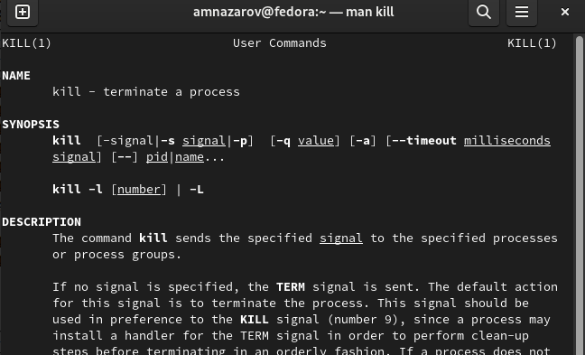
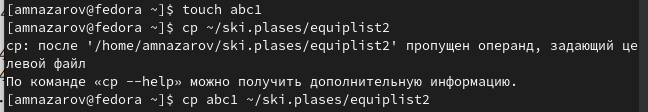
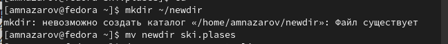
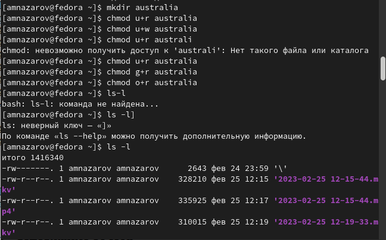
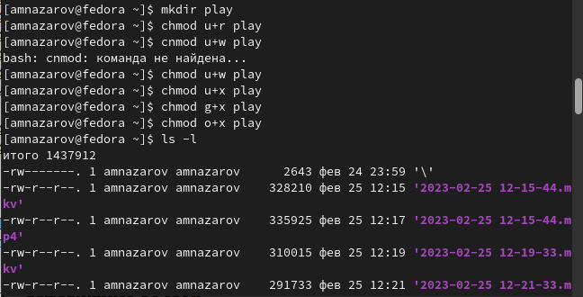
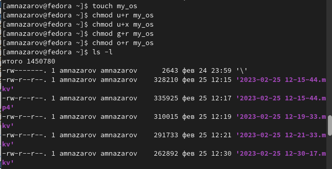
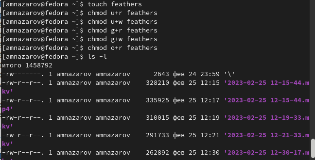

---
## Front matter
title: "Отчет по лабораторной работе №6"
subtitle: "Поиск файлов. Перенаправление ввода-вывода. Просмотр запущенных процессов"
author: "Назаров Алексей Михайлович"

## Generic otions
lang: ru-RU
toc-title: "Содержание"

## Bibliography
bibliography: bib/cite.bib
csl: pandoc/csl/gost-r-7-0-5-2008-numeric.csl

## Pdf output format
toc: true # Table of contents
toc-depth: 2
lof: true # List of figures
lot: true # List of tables
fontsize: 12pt
linestretch: 1.5
papersize: a4
documentclass: scrreprt
## I18n polyglossia
polyglossia-lang:
  name: russian
  options:
	- spelling=modern
	- babelshorthands=true
polyglossia-otherlangs:
  name: english
## I18n babel
babel-lang: russian
babel-otherlangs: english
## Fonts
mainfont: PT Serif
romanfont: PT Serif
sansfont: PT Sans
monofont: PT Mono
mainfontoptions: Ligatures=TeX
romanfontoptions: Ligatures=TeX
sansfontoptions: Ligatures=TeX,Scale=MatchLowercase
monofontoptions: Scale=MatchLowercase,Scale=0.9
## Biblatex
biblatex: true
biblio-style: "gost-numeric"
biblatexoptions:
  - parentracker=true
  - backend=biber
  - hyperref=auto
  - language=auto
  - autolang=other*
  - citestyle=gost-numeric
## Pandoc-crossref LaTeX customization
figureTitle: "Рис."
tableTitle: "Таблица"
listingTitle: "Листинг"
lofTitle: "Список иллюстраций"
lotTitle: "Список таблиц"
lolTitle: "Листинги"
## Misc options
indent: true
header-includes:
  - \usepackage{indentfirst}
  - \usepackage{float} # keep figures where there are in the text
  - \floatplacement{figure}{H} # keep figures where there are in the text
---

# Цель работы

Ознакомление с инструментами поиска файлов и фильтрации текстовых данных.
Приобретение практических навыков: по управлению процессами (и заданиями), по
проверке использования диска и обслуживанию файловых систем

# Выполнение лабораторной работы

1) Я зашел в аккаунт под именем пользователя - aalushin, это мой аккаунт (первая буква имени, первая буква отчества, фамилия)

2) Я записал в файл file.txt названия всех файлов из каталога etc, которые нашел с помощью команды ls. Далее я дополнил файл file.txt названием всех файлов, которые были в домашнем каталоге.

{#fig:001 width=70%}

3) С помощью команду grep я вывел все файлы с расширением conf из файла file.txt. Далее все файлы которые я нашел, я записал в файл conf.txt.

{#fig:002 width=70%}

{#fig:003 width=70%}

4) Я нашел все файлы в домашнем каталоге, которые начинаются на с. Я использовал для вариант: 1) команда ls, 2) команда find. Обе команды нашли всего 1 файл с таким названием.

{#fig:004 width=70%}

5) Я вывел все файлы из каталога etc, которые начинались на символ h.

{#fig:005 width=70%}

6) Я запустил в фоновом режиме процесс, который записывает файлы, начинающиеся на log.

{#fig:006 width=70%}

7) Используя команду rm -r, я удалил каталог, куда записывались файлы начинающиеся на log. Из-за того, что я удалил каталог, фоновый процесс так же остановился.

{#fig:007 width=70%}

8) Я запустил в фоновом режиме редактор gedit.

{#fig:008 width=70%}

9) Я определил индентификатор процесса gedit с помощью команды "ps aux".

{#fig:009 width=70%}

10) Я прочитал справку о команде kill. После чего использовал ее, чтобы остановить фоновый процесс редактора gedit.

{#fig:010 width=70%}

{#fig:011 width=70%}

11) Через команду man я получил информацию о команда df u du. Команда df нужна для анализа каждого смонтированного раздела диска. А команда du выводит число килобайтов, которое использует каждый файл или каталог. После того, как я узнал информацию о этих двух командах, я их запустил.

{#fig:012 width=70%}

{#fig:013 width=70%}

{#fig:014 width=70%}

{#fig:015 width=70%}

12) Я воспользовался справкой find и затем, проанализировав ее, вывел все директории, которые находятся в домашнем каталоге. 

{#fig:016 width=70%}

# Выводы

Я ознакомился с инструментами поиска файлов и фильтрации текстовых данных. Приобрел практические навыки: по управлению процессами, по проверке диска и обслуживанию файловых систем.

# Контрольные вопросы

1) Какие потоки ввода вывода вы знаете?

•	В системе по умолчанию открыто три специальных потока:

–	stdin — стандартный поток ввода (по умолчанию: клавиатура), файловый дескриптор 0;

–	stdout — стандартный поток вывода (по умолчанию: консоль), файловый дескриптор 1;

–	stderr — стандартный поток вывод сообщений об ошибках (по умолчанию: консоль), файловый дескриптор 2.

2) Объясните разницу между операцией > и >>.

•	“>” - перенаправление вывода (stdout) в файл.

•	“>>” - Перенаправление вывода (stdout) в файл, но при этом он открывается в режиме добавления.

3) Что такое конвейер?

•	Конвейер (pipe) служит для объединения простых команд или утилит в цепочки, в которых результат работы предыдущей команды передаётся последующей.

4) Что такое процесс? Чем это понятие отличается от программы?

•	Главное отличие между программой и процессом заключается в том, что программа - это набор инструкций, который позволяет ЦПУ выполнять определенную задачу, в то время как процесс - это исполняемая программа

5) Что такое PID и GID?

•	Каждому процессу Linux или Unix или выполняемой программе, автоматически присваивается идентификационный номер уникального процесса (PID). PID автоматически присваивает номер для каждого процесса в системе.
•	Кроме идентификационного номера пользователя с учётной записью связан идентификатор группы. Группы пользователей применяются для организации доступа нескольких пользователей к некоторым ресурсам. У группы, так же, как и у пользователя, есть имя и идентификационный номер — GID

6) Что такое задачи и какая команда позволяет ими управлять?

•	Запущенные фоном программы называются задачами (jobs). Ими можно управлять с помощью команды jobs, которая выводит список запущенных в данный момент задач. Для завершения задачи необходимо выполнить команду kill.

7) Найдите информацию об утилитах top и htop. Каковы их функции?

•	top - интерактивный просмотрщик процессов. htop аналог top.

8) Назовите и дайте характеристику команде поиска файлов. Приведите примеры использования этой команды.

•	Команда find используется для поиска и отображения на экран имён файлов, соответствующих заданной строке символов.

9) Можно ли по контексту (содержанию) найти файл? Если да, то как?

•	grep -r -n «text» /path , где -n показывает строку, где был найден фрагмент, а -r осуществляет розыск рекурсивно, в файлах в самом каталоге /path и в его подкаталогах;

10) Как определить объем свободной памяти на жёстком диске?

•	С помощью команды df -h можно посмотреть объем занятой и свободной памяти на жестком диске.

11) Как определить объем вашего домашнего каталога?

•	Воспользоваться командой, указанной выше, и найти домашний каталог среди всех остальных.

12) Как удалить зависший процесс?

•	Узнать его идентификационный номер и воспользоваться командой kill.

# Список литературы{.unnumbered}

::: {#refs}
:::
