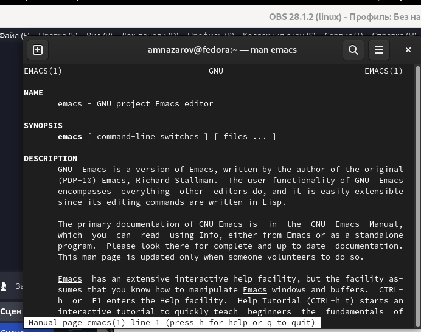
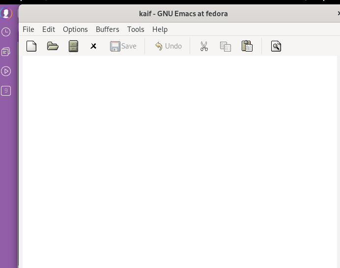
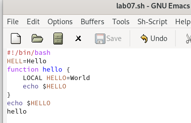
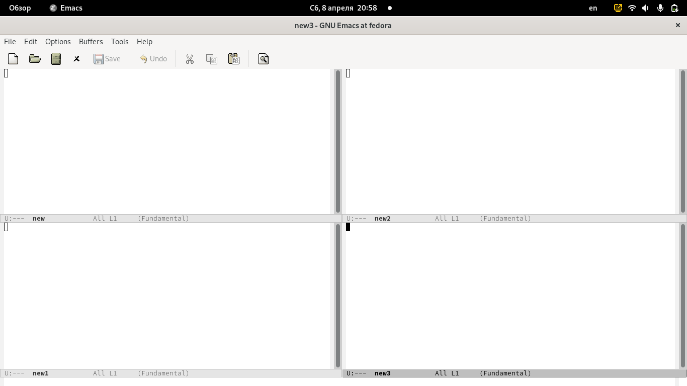

---
## Front matter
lang: ru-RU
title: Презентация по лабораторной работе №9
subtitle: Текстовой редактор emacs
author:
  - Назаров А.М.
institute:
  - Российский университет дружбы народов, Москва, Россия
  - Факультет Физико-математических и естественных наук
date: 9 сентября 2004

## i18n babel
babel-lang: russian
babel-otherlangs: english

## Formatting pdf
toc: false
toc-title: Содержание
slide_level: 2
aspectratio: 169
section-titles: true
theme: metropolis
header-includes:
 - \metroset{progressbar=frametitle,sectionpage=progressbar,numbering=fraction}
 - '\makeatletter'
 - '\beamer@ignorenonframefalse'
 - '\makeatother'
---

# Информация

## Докладчик

:::::::::::::: {.columns align=center}
::: {.column width="70%"}

  * Назаров АЛексей Михайлович
  * студент
  * студент НММбд-02-22
  * Российский университет дружбы народов

:::
::: {.column width="30%"}

:::
::::::::::::::

## Цели и задачи

- Познакомиться с операционной системой Linux. Получить практические навыки работы с редактором Emacs.

# Ход работы

## Редактор emacs

Emacs представляет собой мощный экранный редактор текста, написанный на языке высокого уровня Elisp. Для управления редактором используют комбинация клавиш, за основу взяты клавиши S, M, C. Каждая комбинация выполняет определенную функцию, но в настройках можно изменить значение.

## Создание файлов

Как и во всех редакторах, в emacs можно создать файл с помощью комбинации C-x C-f. Cнизу появляетс минибуфер с надписью Find file, туда вписываем название файла и создаем его.

## Анализ активных буферов

С помощью комбинации C-x C-b мы можем вывести список всех активных буферов. Список отобразится чуть ниже основного фрейма. В этом окне будут файлы которые уже открыты или мы можем открыть. Если мы выберем один из файлов и откроем его, то это окно превратится в буфер, где можно работать.

## Запуск нескольких буферов

Мы можем открыть не только один буфер, но и произвольное количество. Для этого, находясь в основном фрейме, нажимаем сочетание клавиш С-х 3, затем в каждом открытом буфере нажимаем С-х 2. Этой комбинацией мы разделили фрейм на 4 буфера,каждый из которых активен и мы можем в нем работать.

## Поиск и замена

В тексте любого файла мы можем использовать замену или поиск. В этом редакторе очень удобно выполняется система поиска. После комбинации М-s o, у нас открывается поисковая строка, куда мы вводим слово. Далее все результаты выводятся в отдельном буфере. Так же редактор обладает функцией замены, когда мы находим в тексте слово,мы можем заменить его на любое другое. Замена происходит всех слов в тексте.

# Результаты

## Вывод

Я познакомился с ос Linux. Приобрел практические навыки в работе с редактором Emacs.
