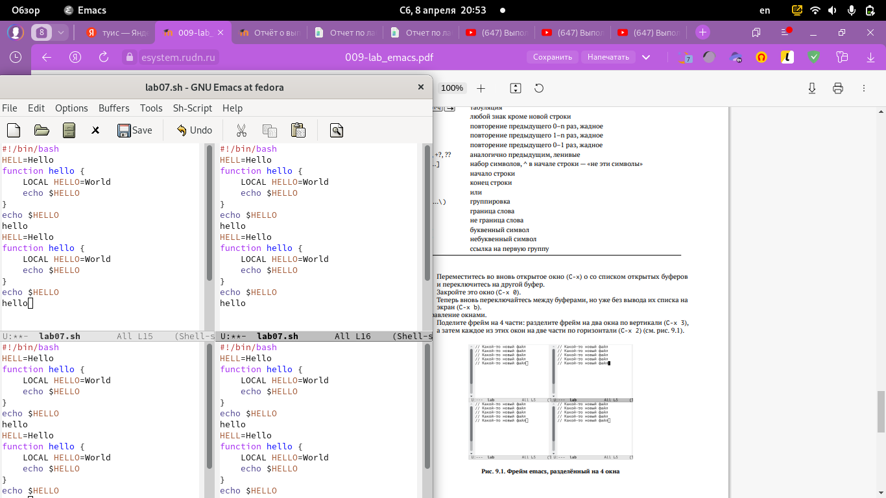

---
## Front matter
title: "Лабораторная работа №9"
subtitle: "Текстовой редактор emacs"
author: "Назаров Алексей Михайлович"

## Generic otions
lang: ru-RU
toc-title: "Содержание"

## Bibliography
bibliography: bib/cite.bib
csl: pandoc/csl/gost-r-7-0-5-2008-numeric.csl

## Pdf output format
toc: true # Table of contents
toc-depth: 2
lof: true # List of figures
lot: true # List of tables
fontsize: 12pt
linestretch: 1.5
papersize: a4
documentclass: scrreprt
## I18n polyglossia
polyglossia-lang:
  name: russian
  options:
	- spelling=modern
	- babelshorthands=true
polyglossia-otherlangs:
  name: english
## I18n babel
babel-lang: russian
babel-otherlangs: english
## Fonts
mainfont: PT Serif
romanfont: PT Serif
sansfont: PT Sans
monofont: PT Mono
mainfontoptions: Ligatures=TeX
romanfontoptions: Ligatures=TeX
sansfontoptions: Ligatures=TeX,Scale=MatchLowercase
monofontoptions: Scale=MatchLowercase,Scale=0.9
## Biblatex
biblatex: true
biblio-style: "gost-numeric"
biblatexoptions:
  - parentracker=true
  - backend=biber
  - hyperref=auto
  - language=auto
  - autolang=other*
  - citestyle=gost-numeric
## Pandoc-crossref LaTeX customization
figureTitle: "Рис."
tableTitle: "Таблица"
listingTitle: "Листинг"
lofTitle: "Список иллюстраций"
lotTitle: "Список таблиц"
lolTitle: "Листинги"
## Misc options
indent: true
header-includes:
  - \usepackage{indentfirst}
  - \usepackage{float} # keep figures where there are in the text
  - \floatplacement{figure}{H} # keep figures where there are in the text
---

# Цель работы

Познакомиться с операционной системой Linux. Получить практические навыки работы с редактором Emacs.

# Выполнение лабораторной работы

1) Я создал файл lab07.sh с помощью комбинаций клавиш.

{#fig:001 width=70%}

2) Я набрал нужный текст в файле.

{#fig:002 width=70%}

3) Сохранил файл с помощью комбинации.

{#fig:003 width=70%}

4) Командой С-К я убрал строку.

{#fig:004 width=70%}

5) Строку которую я вырезал, я вставил в конец файла.

{#fig:005 width=70%}

6) Я выделил область текста с помощью комбинации С-spacе, скопировал ее и вставил в конец текста.

{#fig:006 width=70%}

7) Выдел область которую вставил и вырезал ее с помощью комбинации С-w.

{#fig:007 width=70%}

8) Отменил удаление выделенной область через комбинацию С-/.

{#fig:008 width=70%}

9) Научился использовать команды для перемещения курсора. С-а - курсор в начале строки. С-е - курсор в конце строки, М-< - курсор в начале буфера обмена, и М-> - курсор в конце буфера обмена.

{#fig:009 width=30%}

{#fig:010 width=30%}

{#fig:011 width=30%}

{#fig:012 width=30%}

10) С помощью комбинации клавиш я вывел список активных буферов на экран.

{#fig:013 width=70%}

11) Во втором окне переключился на буфер lab07.sh.

{#fig:014 width=70%}

12) С помощью комбинации С-х 0, я закрыл второй буфер.

{#fig:015 width=70%}

13) Я переключился на буфер lab07.sh без вывода на экран.

{#fig:016 width=70%}

14) Поделил фрейм на 4 части и везде открыт файл lab07.sh.

{#fig:017 width=70%}

15) В каждом из буферов я открыл новые файлы.

{#fig:018 width=70%}

16) Я перешел в режим поиска и нашел слово HELLO.

{#fig:019 width=70%}

17) Я закрыл поиск.

{#fig:020 width=70%}

20) Я испробовал другой режим поиска. Отличие этого режима от того, что я проверял до этого, это разный вывод результата.Если в первом случаи, поиск показывал результаты прям в тексте, то здесь он выводит их в отдельном окне.

{#fig:021 width=70%}

# Выводы

Я познакомился с ос Linux. Приобрел практические навыки в работе с редактором Emacs.

# Контрольные вопросы

1. Кратко охарактеризуйте редактор emacs.

Emacs представляет собой мощный экранный редактор текста, написанный на языке высокого уровня Elisp.

2. Какие особенности данного редактора могут сделать его сложным для освоения новичком?

Многие рутинные операции в Emacs удобнее производить с помощью клавиатуры, а не графического меню. Наиболее часто в командах Emacs используются сочетания c клавишами Ctrl и Meta (в обозначениях Emacs: C- и M-; клавиша Shift в Emasc обозначается как S-). Так как на клавиатуре для IBM PC совместимых ПК клавиши Meta нет, то вместо неё можно использовать Alt или Esc.

3. Своими словами опишите, что такое буфер и окно в терминологии emacs’а.

Если своими словами, то буфер - это файл, содержащий какой-либо текст. Окно же можно сказать область, где вы водится текст определенного буфера.

4. Можно ли открыть больше 10 буферов в одном окне?

Можно открыть больше 10 буферов в одном окне.

5. Какие буферы создаются по умолчанию при запуске emacs?

Только что запущенный Emacs несет один буфер с именем `scratch’, который может быть использован для вычисления выражений Лиспа в Emacs.
6. Какие клавиши вы нажмёте, чтобы ввести следующую комбинацию C-c | и C-c C-|?
Ctrl-c |(первые две нажму вместе, а третью отдельно), Ctrl-c Ctrl-|(каждую пару нажму раздельно).
7. Как поделить текущее окно на две части?
Разделить фрейм на два окна по вертикали (C-x 3),а по горизонтали (C-x 2) 
8. В каком файле хранятся настройки редактора emacs?
В файле Emacs хранятся настройки редактора.
9. Какую функцию выполняет клавиша и можно ли её переназначить?
Кнопка BACKSPACE = функции C-k и ее можно переназначить.
10. Какой редактор вам показался удобнее в работе vi или emacs? Поясните почему
Редактор Emacs мне показался удобнее, так как в нем больше возможностей по сравнению с vi.
